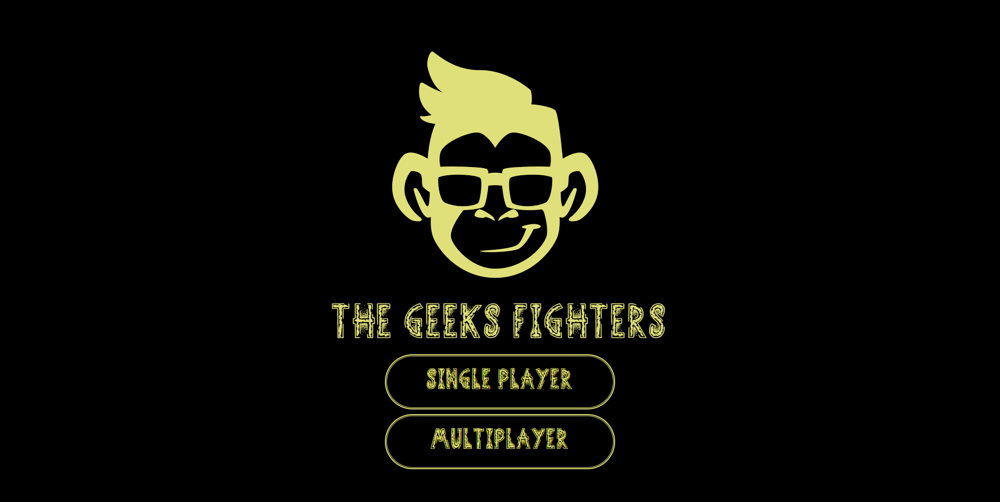
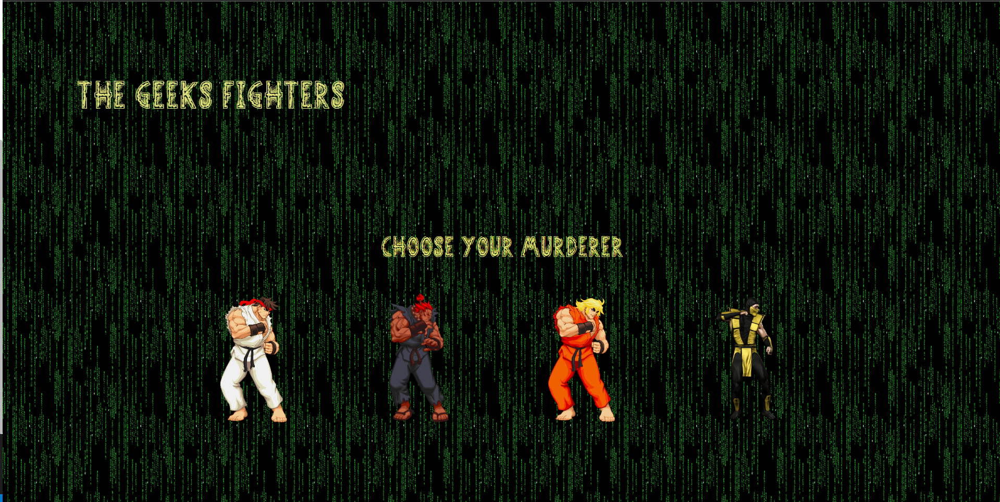
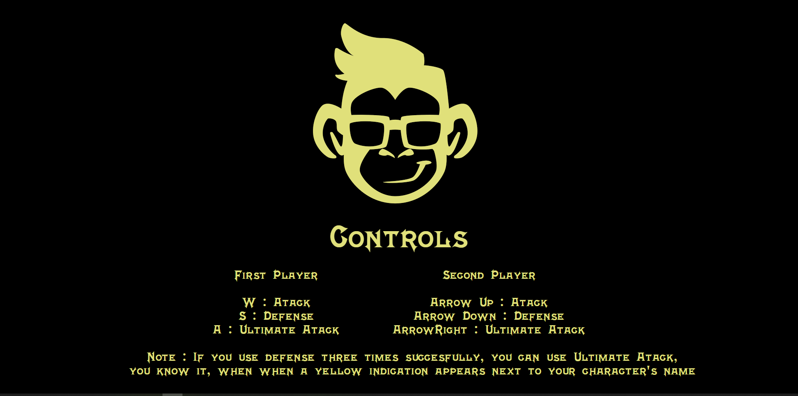
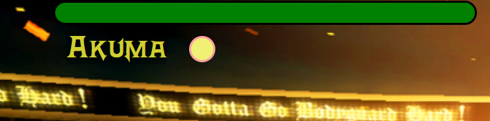
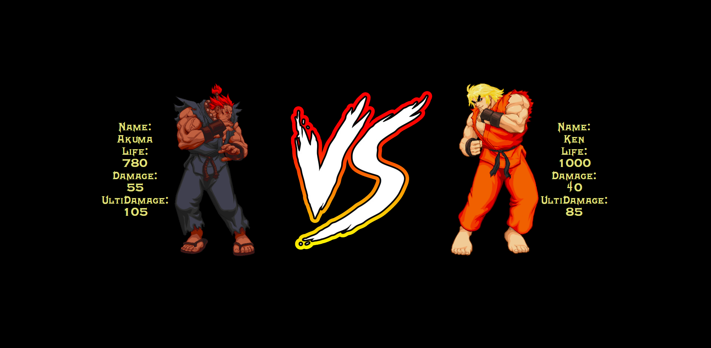
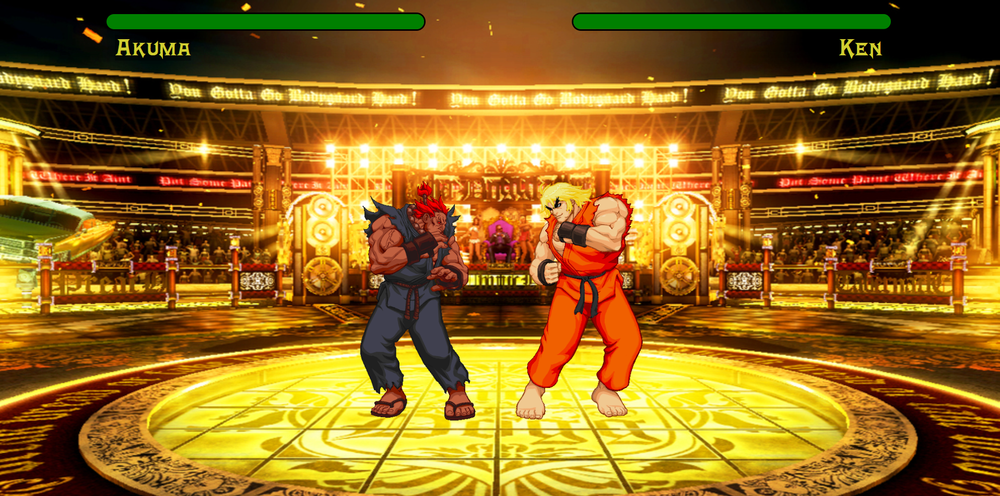
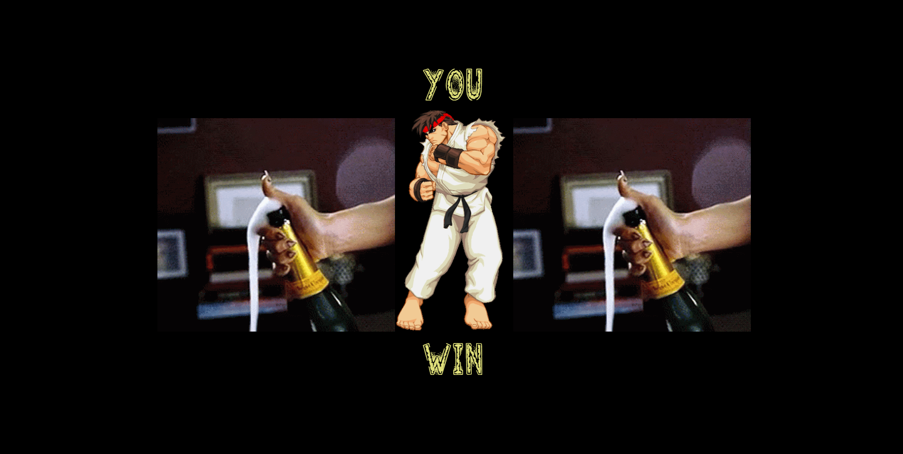

<h1 align="center">
The Geeks Fighters
</h1>

___
<h5 align="center">SPA de juego de lucha realizado para el Bootcamp FSD de GeeksHubs. Por José Carlos Núñez.</h5>

 

    <a href="#about">About</a> ·
    <a href="#usage">Usage</a> ·
    <a href="#features">Features</a>

___

## About

He creado un SPA, basado en juegos de lucha que jugaba de pequeño, con funcionalidades mas básicas.

 
 Vista Home

La SPA esta compuesta por ocho paginas, las cuales se suceden en sumayoria de manera automática con intervalos de tiempo.

Las imagenes y gif han sido obtenidas de Google Images.

Tiene dos modos de juego, "Single Player", para el cual he diseñado una IA básica con la que poder interactuar. Y "Multiplayer", en la cual se elegiran dos personajes de los cuatro de los que dispone el juego.

---

## Usage

Se puede desplegar a través de Github pages.
La navegación es simple e intuitiva.

Selecciona el modo de juego que quieres en la pantalla "home".

 
 Vista Home

En la siguiente página, debes seleccionar al jugador o jugadores dependiendo del modo de juego que hayas seleccionado.

Una vez seleccionado, automáticamente nos pasara a la siguiente página.

 
 Vista Selección de personaje

La siguiente página, nos mostrara la información sobre los controles los cuales seran introducidos por teclado.

 
 Vista Controles

Una de las funcionalidades, es la "Ulti", que sabremos que la tenemos cuando aparezca este simbolo al lado del nombre de nuestro personaje.

 
 Vista Ulti

Pasados unos segundos, nos mostrará la información de los luchadores que pelearan.

 
 Vista Información

Acto seguido dará paso a la pantalla de la pelea, en la cual podemos ver a ambos luchadores, la barra de vida que tienen, y tus respectivos nombres.

 
 Vista Pelea

Cuando uno de los luchadores gane, nos mostrara la pantalla de la victoria, y luego reseteara todos los datos y nos devolverá a la página principal.

 
 Vista Winner

---

## Features

* El proyecto ha sido realizado con  HTML, CSS, y JavaScript.
* DOM
* Imagenes extraidas en su mayoría de Google-Images.
* GitHub Pages
